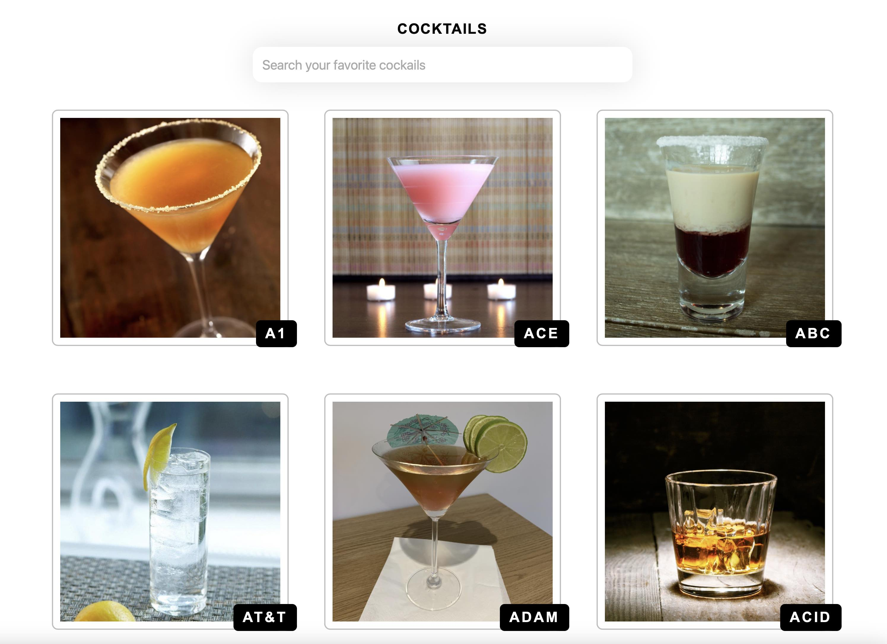

# John Smilga Course - Coded by Abraham Orherhe

## Welcome! 👋

### Links

- Solution URL: [solution](https://github.com/aeorherhe/cocktails.git)
- Live Site URL: [live site](https://aeorherhe-cocktails.netlify.app/)

### Built with

- Semantic HTML5 markup
- CSS custom properties
- Flexbox
- Mobile-first workflow
- Vanila JavaScript
- Local Storage
- window location replace
- ES6 modules

## Author

- Github - [Abraham Orherhe](https://github.com/aeorherhe)
- Frontend Mentor - [@Abraham Orherhe](https://www.frontendmentor.io/profile/aeorherhe)
